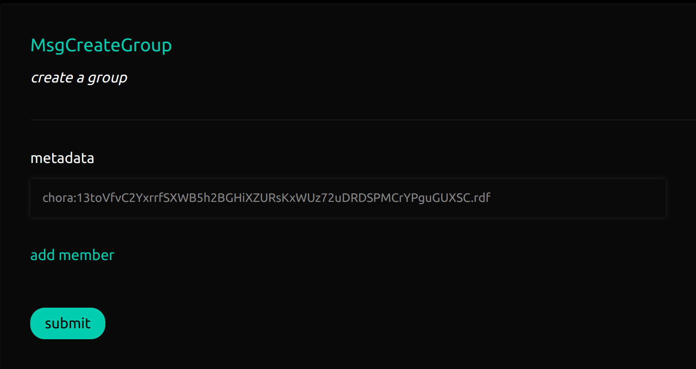

# Creating Groups

A group is an entity on chain that can be used to manage assets and other entities.

A group is made up of group members (accounts that have voting power within the group) and group policies (group accounts that execute proposals based on defined decision policies).

